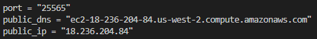

# Minecraft Server Deployment

This repository contains Terraform configuration files and a shell script to deploy a Minecraft server on AWS using Docker.

## Background

In this tutorial, we will deploy a Minecraft server on AWS using Terraform and Docker. The deployment process involves provisioning an EC2 instance, configuring security groups, and starting the Minecraft server using Docker Compose.

## Requirements

To run the Minecraft server deployment pipeline, you need:

- Terraform: Make sure you have Terraform installed on your machine.
- AWS Account: You'll need an AWS account with appropriate permissions to provision resources.
- AWS CLI: Set up AWS CLI and configure it with your AWS credentials.
- SSH client: You'll need an SSH client to connect to the Minecraft server.

## Diagram


main.tf launches an AWS EC2 instance, and then runs run.sh on the instance, which installs Docker on the instance and runs a minecraft server docker container on the instance

## Setup

1. Clone this repository:
   run this command in your desired directory/folder

   ```
   git clone 
   ```
2. get your AWS credentials (if you haven't already) copy it into ~/.aws/credentials. for the AWS Learner Lab, this can be found in your "AWS Details"
3. run this command in the directory:

   ```
   terraform init
   ```
4. then, run:

   ```
   terraform apply
   ```

## Connecting to the minecraft server

Once terraform finishes applying, you'll get an output on your terminal that looks like this:



connect in minecraft through the listed public ip and port.

## Cleanup

To stop the server, run the following command:

```
terraform destroy
```
